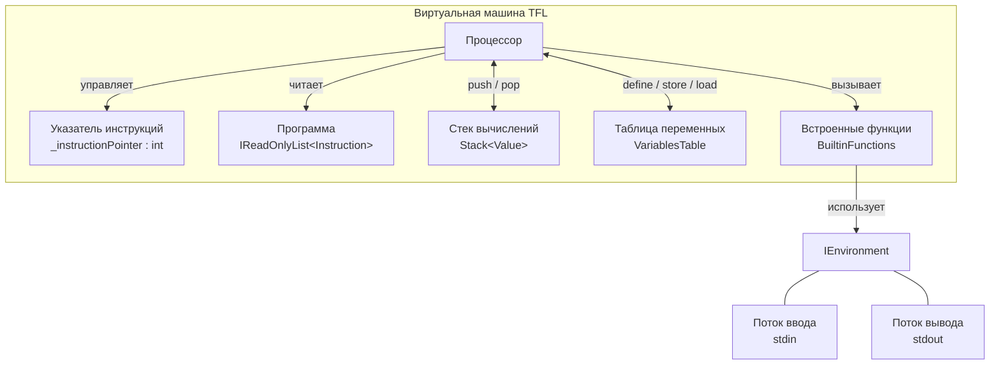

# Виртуальная машина TFL

Виртуальная машина TFL последовательно выполняет инструкции программы, обеспечивая вычисление выражений, работу с переменными и взаимодействие с окружением.

## Диаграмма

## Модель виртуальной машины

Структура виртуальной машины TFL состоит из следующих элементов:

1. **Список инструкций** — упорядоченный список инструкций, составляющих программу (`IReadOnlyList<Instruction>`);
2. **Указатель инструкций** — целочисленный индекс следующей инструкции для выполнения (`_instructionPointer`); после чтения инструкции автоматически увеличивается на 1;
3. **Стек вычислений** — стек значений типа `Value`, используемый для вычисления выражений (`Stack<Value>`);
4. **Таблица переменных** — единая плоская таблица (`VariablesTable`), хранящая все переменные программы в виде словаря `имя → значение`;
5. **Встроенные функции** — набор предопределённых функций (`BuiltinFunctions`), вызываемых через инструкцию `CallBuiltin`;
6. **Окружение** — абстракция `IEnvironment`, предоставляющая доступ к потоку ввода (`ReadInt`) и потоку вывода (`PrintInt`).

## Инструкции

Каждая инструкция содержит:

1. **Код инструкции** — значение из перечисления `InstructionCode`;
2. **Операнд** — необязательное значение типа `Value` (если операнд отсутствует, хранится `Value.Void`).

### Условные обозначения

- Операнд указывается в квадратных скобках: `[Value]`;
- Вершина стека вычислений обозначается `EVAL[^1]`, следующее за ней значение — `EVAL[^2]`;
- Каждая инструкция имеет свой индекс; нумерация начинается с 0.

## Набор инструкций

### Работа со стеком и переменными

1. `Push [Value]` — добавляет значение на стек вычислений.
    - Операнд хранит добавляемое значение.

2. `Pop` — удаляет значение с вершины стека вычислений.

3. `DefineVar [Name]` — объявляет новую переменную в таблице переменных.
    - Операнд хранит имя переменной.
    - Снимает `EVAL[^1]` со стека и записывает его как начальное значение переменной.
    - Бросает исключение, если переменная с таким именем уже объявлена.

4. `StoreVar [Name]` — присваивает значение существующей переменной.
    - Операнд хранит имя переменной.
    - Снимает `EVAL[^1]` со стека и записывает его в переменную.
    - Бросает исключение, если переменная не объявлена.

5. `LoadVar [Name]` — читает значение переменной и помещает его на стек вычислений.
    - Операнд хранит имя переменной.
    - Бросает исключение, если переменная не найдена.

### Арифметические операции

6. `Add` — выполняет сложение `EVAL[^2] + EVAL[^1]`.
    - Для строк (`string`) — конкатенация.
    - Для вещественных чисел (`float`) — вещественное сложение.
    - Для целых чисел (`int`) — целочисленное сложение.
    - Снимает два значения, результат помещает на стек.

7. `Subtract` — выполняет вычитание `EVAL[^2] - EVAL[^1]`.
    - Для `float` — вещественное; для `int` — целочисленное.
    - Снимает два значения, результат помещает на стек.

8. `Multiply` — выполняет умножение `EVAL[^2] * EVAL[^1]`.
    - Для `float` — вещественное; для `int` — целочисленное.
    - Снимает два значения, результат помещает на стек.

9. `Divide` — выполняет деление `EVAL[^2] / EVAL[^1]`.
    - Для `float` — вещественное; для `int` — целочисленное.
    - Снимает два значения, результат помещает на стек.

10. `Modulo` — выполняет взятие остатка `EVAL[^2] % EVAL[^1]`.
    - Для `float` — вещественный остаток; для `int` — целочисленный.
    - Снимает два значения, результат помещает на стек.

11. `Negate` — меняет знак числа на вершине стека.
    - Для `float` — вещественное отрицание; для `int` — целочисленное.
    - Снимает одно значение, результат помещает на стек.

### Операции сравнения

12. `Equal` — проверяет равенство `EVAL[^2] == EVAL[^1]`.
    - Для строк — лексикографическое сравнение.
    - Для `float` — вещественное; для `int` — целочисленное.
    - Снимает два значения, помещает на стек булево значение (`bool`).

13. `NotEqual` — проверяет неравенство `EVAL[^2] != EVAL[^1]`.
    - Аналогично `Equal`, но с инвертированным результатом.
    - Снимает два значения, помещает на стек булево значение (`bool`).

### Встроенные функции

14. `CallBuiltin [Code]` — вызывает встроенную функцию.
    - Операнд хранит целочисленный код функции (`BuiltinFunctionCode`).
    - Указатель инструкций не меняется.

    Доступные встроенные функции:

    | Код     | Значение | Сигнатура             | Описание                                                    |
    |---------|----------|-----------------------|-------------------------------------------------------------|
    | `Print` | 1        | `print(value: int)`   | Снимает `EVAL[^1]` и выводит целое число в поток вывода     |
    | `ReadI` | 2        | `read_i() -> int`     | Читает целое число из потока ввода, помещает результат на стек |

### Завершение программы

15. `Halt` — останавливает выполнение программы.
    - Снимает `EVAL[^1]` и использует его как целочисленный код возврата.
    - Программа обязана завершаться этой инструкцией — виртуальная машина проверяет это при инициализации и бросает исключение, если последняя инструкция не `Halt`.
    - Кодогенератор всегда добавляет `Push 0` непосредственно перед `Halt`, обеспечивая код возврата 0 по умолчанию.
