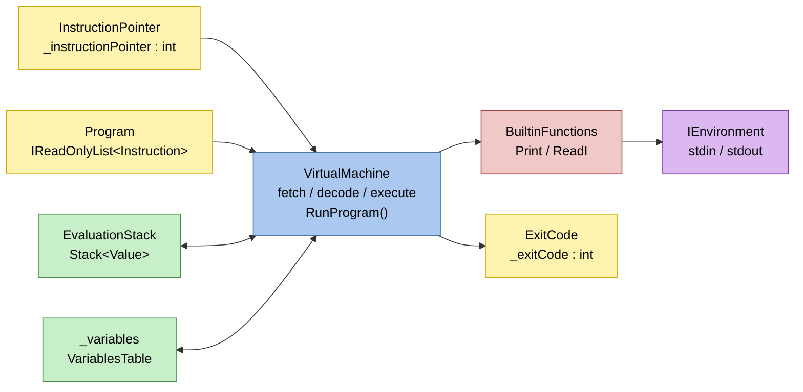

# Виртуальная машина TFL

Виртуальная машина TFL является **стековой**: все операнды передаются через стек значений, а не через регистры.
Программа компилируется в последовательность байт-кодовых инструкций.

## Иллюстрация

Иллюстрация структуры виртуальной машины:

## Структура VM

- `VirtualMachine` — исполнительный цикл `fetch / decode / execute`.
- `Program` (`IReadOnlyList<Instruction>`) — список байт-кодовых инструкций.
- `InstructionPointer` (`_instructionPointer`) — индекс следующей инструкции.
- `EvaluationStack` (`Stack<Value>`) — стек значений.
- `_variables` (`VariablesTable`) — единая плоская таблица переменных: словарь `имя → значение`.
- `BuiltinFunctions` — реализация встроенных функций (`Print`, `ReadI`).
- `IEnvironment` (`stdin / stdout`) — внешний ввод-вывод.
- `ExitCode` (`_exitCode`) — код завершения, который возвращает `RunProgram`.

## Цикл выполнения

1. Взять `instruction = Program[InstructionPointer]`.
2. Увеличить `InstructionPointer` на 1.
3. Выполнить действие по `instruction.Code`.
4. Повторять, пока не встретится `Halt`.

Проверки при инициализации VM:

- программа не пустая;
- последняя инструкция — `Halt`.

## Формат инструкций

Инструкция содержит:

- `Code: InstructionCode` — код операции;
- `Operand: Value` — операнд (поле есть всегда; для инструкций без операнда содержит `Value.Void`).

Типы `Value`, используемые VM:

- `int` (C# `int`);
- `float` (C# `double`);
- `string` (C# `string`);
- `void` — специальный тип-маркер, обозначает отсутствие значения.

## Набор инструкций

Обозначения:

- `EVAL[^1]` — вершина стека;
- `EVAL[^2]` — элемент под вершиной.

### Стек и переменные

1. `Push [Value]`  
   Помещает `[Value]` в `EvaluationStack`.

2. `Pop`  
   Снимает `EVAL[^1]` и отбрасывает его.

3. `DefineVar [Name]`  
   Снимает `EVAL[^1]` и создаёт новую переменную `_variables[Name]` с этим значением.  
   Если переменная с таким именем уже существует, выбрасывается ошибка выполнения.

4. `StoreVar [Name]`  
   Снимает `EVAL[^1]` и записывает его в существующую переменную `_variables[Name]`.  
   Если переменная не объявлена, выбрасывается ошибка выполнения.

5. `LoadVar [Name]`  
   Читает `_variables[Name]` и кладёт значение в `EvaluationStack`.  
   Если переменная не найдена, выбрасывается ошибка выполнения.

### Арифметика

6. `Add`  
   Снимает два операнда (`left = EVAL[^2]`, `right = EVAL[^1]`), кладёт результат в стек.  
   Для `string` выполняется конкатенация; для `float` — вещественное сложение; для `int` — целочисленное.

7. `Subtract`  
   Снимает два операнда, кладёт `left - right`.  
   Для `float` — вещественное; для `int` — целочисленное.

8. `Multiply`  
   Снимает два операнда, кладёт `left * right`.  
   Для `float` — вещественное; для `int` — целочисленное.

9. `Divide`  
   Снимает два операнда, кладёт `left / right`.  
   Для `float` — вещественное деление; для `int` — целочисленное деление.

10. `Modulo`  
    Снимает два операнда, кладёт `left % right`.  
    Для `float` — вещественный остаток; для `int` — целочисленный.

11. `Negate`  
    Снимает `EVAL[^1]`, кладёт `-EVAL[^1]`.  
    Для `float` — вещественное отрицание; для `int` — целочисленное.

### Сравнение

12. `Equal`  
    Снимает два операнда (`left = EVAL[^2]`, `right = EVAL[^1]`), кладёт результат `left == right` (тип `bool`).  
    Для `string` — лексикографическое сравнение; для `float` — вещественное; для `int` — целочисленное.

13. `NotEqual`  
    Снимает два операнда, кладёт результат `left != right` (тип `bool`).  
    Логика аналогична `Equal` с инвертированным результатом.

### Встроенные функции

14. `CallBuiltin [Code]`  
    Вызывает встроенную функцию по коду `BuiltinFunctionCode`.  
    Если функция возвращает значение, оно помещается в `EvaluationStack`.

    Поддерживаемые встроенные функции:

    | Код     | Значение | Действие                                                         |
    |---------|----------|------------------------------------------------------------------|
    | `Print` | 1        | Снимает `EVAL[^1]`, выводит его как целое число в `stdout`       |
    | `ReadI` | 2        | Читает целое число из `stdin`, кладёт результат (`int`) в стек   |

### Завершение выполнения

15. `Halt`  
    Останавливает VM.  
    Снимает `EVAL[^1]` и сохраняет его как `ExitCode` (целое число), которое возвращает `RunProgram`.
