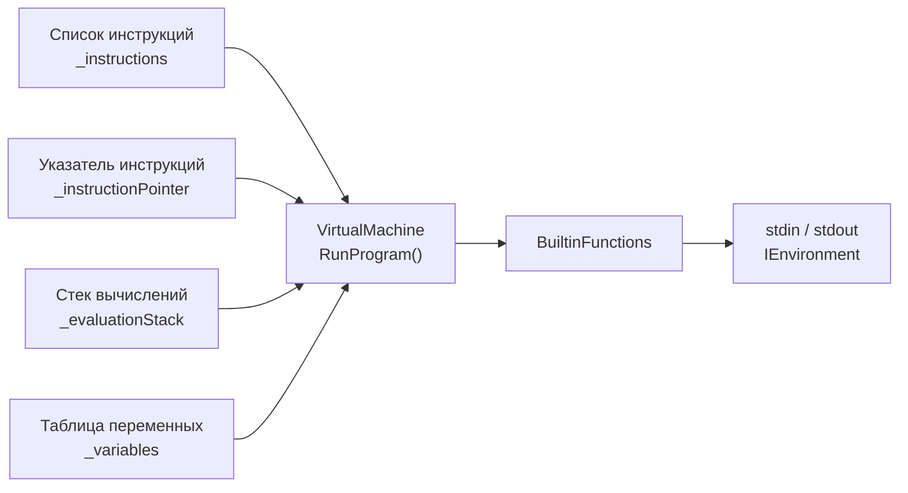

# Виртуальная машина Swiston

Виртуальная машина Swiston выполняет инструкции по определённым правилам, тем самым обеспечивая возможность вычисления любой программы на Swiston.

Эта статья описывает принцип работы (модель работы) виртуальной машины Swiston.

## Иллюстрация

Иллюстрация состояния виртуальной машины языка Swiston в момент выполнения программы:

## Модель виртуальной машины

Структура виртуальной машины Swiston состоит из следующих элементов:

1. Список инструкций, составляющих программу;
2. Указатель на следующую инструкцию;
3. Стек значений, используемый для вычисления выражений;
4. Таблица переменных, хранящая все переменные программы;

## Инструкции

Каждая инструкция программы содержит:

1. Код инструкции из набора инструкций;
2. Значение операнда (необязательное).

## Набор инструкций

Каждая инструкция может иметь один операнд, который хранится вместе с инструкцией.

Условные обозначения в списке инструкций:

- Операнд указывается в квадратных скобках, например: `[Value]`;
- Вершина стека вычислений обозначается `EVAL[^1]`, следующее за ней значение — `EVAL[^2]` и так далее;
- Каждая инструкция имеет свой номер (индекс), нумерация инструкций начинается с 0.

Список инструкций:

1. `Push [Value]` добавляет значение на стек вычислений
    - Операнд хранит добавляемое значение
2. `Pop` удаляет значение со стека вычислений
3. `DefineVar [Name]` записывает в новую переменную значение `EVAL[^1]`
    - Операнд хранит имя переменной
    - Убирает значение со стека вычислений
    - Бросает исключение, если переменная с таким именем уже объявлена
4. `StoreVar [Name]` записывает в ранее созданную переменную значение `EVAL[^1]`
    - Операнд хранит имя переменной
    - Убирает значение со стека вычислений
    - Бросает исключение, если переменная не была объявлена
5. `LoadVar [Name]` читает значение переменной
    - Операнд хранит имя переменной
    - Помещает результат в стек вычислений
    - Бросает исключение, если переменная не была объявлена
6. `Add` выполняет бинарную операцию сложения
    - Вычисляет `EVAL[^2] + EVAL[^1]`
    - Для типа `string` выполняет конкатенацию строк
    - Для типов `int` и `float` выполняет арифметическое сложение
    - Снимает два значения со стека вычислений, результат помещает в стек вычислений
7. `Subtract` выполняет бинарную операцию вычитания
    - Вычисляет `EVAL[^2] - EVAL[^1]`
    - Поддерживаемые типы: `int`, `float`
    - Снимает два значения со стека вычислений, результат помещает в стек вычислений
8. `Multiply` выполняет бинарную операцию умножения
    - Вычисляет `EVAL[^2] * EVAL[^1]`
    - Поддерживаемые типы: `int`, `float`
    - Снимает два значения со стека вычислений, результат помещает в стек вычислений
9. `Divide` выполняет бинарную операцию деления
    - Вычисляет `EVAL[^2] / EVAL[^1]`
    - Поддерживаемые типы: `int`, `float`
    - Снимает два значения со стека вычислений, результат помещает в стек вычислений
10. `Modulo` выполняет бинарную операцию остатка от деления
    - Вычисляет `EVAL[^2] % EVAL[^1]`
    - Поддерживаемые типы: `int`, `float`
    - Снимает два значения со стека вычислений, результат помещает в стек вычислений
11. `Negate` выполняет унарную операцию смены знака
    - Вычисляет `-EVAL[^1]`
    - Поддерживаемые типы: `int`, `float`
    - Снимает значение со стека вычислений, результат помещает в стек вычислений
12. `Equal` выполняет бинарную операцию "равно"
    - Вычисляет `EVAL[^2] == EVAL[^1]`
    - Поддерживаемые типы: `int`, `float`, `string`
    - Снимает два значения со стека вычислений, помещает в стек `1` если истина, `0` если ложь
13. `NotEqual` выполняет бинарную операцию "не равно"
    - Вычисляет `EVAL[^2] != EVAL[^1]`
    - Поддерживаемые типы: `int`, `float`, `string`
    - Снимает два значения со стека вычислений, помещает в стек `1` если истина, `0` если ложь
14. `CallBuiltin [Code]` вызывает встроенную функцию
    - Операнд хранит целочисленный номер встроенной функции (`BuiltinFunctionCode`)
    - Аргументы передаются через стек, возвращаемое значение (если есть) помещается в стек вычислений
15. `Halt` останавливает работу программы
    - Снимает значение со стека вычислений, используя его как целочисленный код возврата
    - Является последней инструкцией любой программы

## Встроенные функции

Встроенные функции вызываются инструкцией `CallBuiltin`. Аргументы передаются через стек вычислений.

| Код | Имя | Сигнатура | Описание |
|---|---|---|---|
| 1 | `Print` | `print(value)` | Снимает `EVAL[^1]` и выводит его в stdout |
| 2 | `ReadI` | `readi() → int` | Читает целое число из stdin, помещает результат в стек вычислений |
| 3 | `ReadF` | `readf() → float` | Читает вещественное число из stdin, помещает результат в стек вычислений |
| 4 | `ReadS` | `reads() → string` | Читает строку из stdin, помещает результат в стек вычислений |
| 5 | `Length` | `length(string) → int` | Снимает `EVAL[^1]`, помещает в стек длину строки как `int` |
| 6 | `Substr` | `substr(s: string, start: int, length: int) -> string` | Снимает `EVAL[^3]` `EVAL[^2]` `EVAL[^1]`, помещает в стек новую строку |
